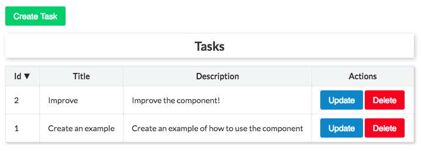

# React CRUD Table
A table that includes all the CRUD operations.


## Basic Example
This example shows the basics CRUD (Create, Read, Update, and Delete) and sorting operations.

[In Code Sandbox](https://codesandbox.io/s/6v8qm0jm43)

```shell 
$ npm install react-crud-table --save
```

```js
import React from 'react';
import ReactDOM from 'react-dom';
import CRUDTable,
{
  Fields,
  Field,
  CreateForm,
  UpdateForm,
  DeleteForm,
} from 'react-crud-table';

// Component's Base CSS
import from './index.css';

const DescriptionRenderer = ({ field }) => <textarea {...field} />;

let tasks = [
  {
    id: 1,
    title: 'Create an example',
    description: 'Create an example of how to use the component',
  },
  {
    id: 2,
    title: 'Improve',
    description: 'Improve the component!',
  },
];

const SORTERS = {
  NUMBER_ASCENDING: mapper => (a, b) => mapper(a) - mapper(b),
  NUMBER_DESCENDING: mapper => (a, b) => mapper(b) - mapper(a),
  STRING_ASCENDING: mapper => (a, b) => mapper(a).localeCompare(mapper(b)),
  STRING_DESCENDING: mapper => (a, b) => mapper(b).localeCompare(mapper(a)),
};

const getSorter = (data) => {
  const mapper = x => x[data.field];
  let sorter = SORTERS.STRING_ASCENDING(mapper);

  if (data.field === 'id') {
    sorter = data.direction === 'ascending' ?
      SORTERS.NUMBER_ASCENDING(mapper) : SORTERS.NUMBER_DESCENDING(mapper);
  } else {
    sorter = data.direction === 'ascending' ?
      SORTERS.STRING_ASCENDING(mapper) : SORTERS.STRING_DESCENDING(mapper);
  }

  return sorter;
};


let count = tasks.length;
const service = {
  fetchItems: (payload) => {
    let result = Array.from(tasks);
    result = result.sort(getSorter(payload.sort));
    return Promise.resolve(result);
  },
  create: (task) => {
    count += 1;
    tasks.push({
      ...task,
      id: count,
    });
    return Promise.resolve(task);
  },
  update: (data) => {
    const task = tasks.find(t => t.id === data.id);
    task.title = data.title;
    task.description = data.description;
    return Promise.resolve(task);
  },
  delete: (data) => {
    const task = tasks.find(t => t.id === data.id);
    tasks = tasks.filter(t => t.id !== task.id);
    return Promise.resolve(task);
  },
};

const styles = {
  container: { margin: 'auto', width: 'fit-content' },
};

const Example = () => (
  <div style={styles.container}>
    <CRUDTable
      caption="Tasks"
      fetchItems={payload => service.fetchItems(payload)}
    >
      <Fields>
        <Field
          name="id"
          label="Id"
          hideInCreateForm
        />
        <Field
          name="title"
          label="Title"
          placeholder="Title"
        />
        <Field
          name="description"
          label="Description"
          render={DescriptionRenderer}
        />
      </Fields>
      <CreateForm
        title="Task Creation"
        message="Create a new task!"
        trigger="Create Task"
        onSubmit={task => service.create(task)}
        submitText="Create"
        validate={(values) => {
          const errors = {};
          if (!values.title) {
            errors.title = 'Please, provide task\'s title';
          }

          if (!values.description) {
            errors.description = 'Please, provide task\'s description';
          }

          return errors;
        }}
      />

      <UpdateForm
        title="Task Update Process"
        message="Update task"
        trigger="Update"
        onSubmit={task => service.update(task)}
        submitText="Update"
        validate={(values) => {
          const errors = {};

          if (!values.id) {
            errors.id = 'Please, provide id';
          }

          if (!values.title) {
            errors.title = 'Please, provide task\'s title';
          }

          if (!values.description) {
            errors.description = 'Please, provide task\'s description';
          }

          return errors;
        }}
      />

      <DeleteForm
        title="Task Delete Process"
        message="Are you sure you want to delete the task?"
        trigger="Delete"
        onSubmit={task => service.delete(task)}
        submitText="Delete"
        validate={(values) => {
          const errors = {};
          if (!values.id) {
            errors.id = 'Please, provide id';
          }
          return errors;
        }}
      />
    </CRUDTable>
  </div>
);

Example.propTypes = {};

ReactDOM.render(
  <Example />,
  document.getElementById('root')
);
```



## Components Properties

### CRUDTable Component
  The CRUDTable Component is the parent component. All the others component should be children of it.

  #### `caption`: string
  Items table caption

  #### `fetchItems`: function
  A function that returns the read items asynchronously. This should return a promise.

  #### `items`: array
  Items to be shown in the table. Alternative to the `fetchItems` property.

### Fields Component
  A child of the `CRUDTable` Component. This Component should contain the individual fields definition.
  Its children are `Field` components.

### Field Component
  A child of the `Fields` Component. This Component is the individual definition of the fields.

  #### `name`: string
  The name of the field (`required`).

  #### `label`: node
  The label of the field(`required`)

  #### `type`: string
  The type of the field. This can be (`text`, `number`, `date`, etc). It is useful when you want to make it queryable and/or sortable.

  #### `tableValueResolver`: any
  It is the mapper of the field value in the table. It can be a string representing a query to the object (For example `company.name`) or an function that takes the item as an argument and returns a value.

  #### `hideInCreateForm`: bool
  To hide this field in the Create Form.

  #### `hideInUpdateForm`: bool
  To hide this field in the Update Form.

  #### `queryable`: bool
  To indicate this field is queryable.

### CreateForm, UpdateForm, and DeleteForm Components
  This components are used to configure the forms to create, update and delete the items. Not including one of this forms means that you dont want support for the corresponding operation of the form and therefore will be hidden.


  #### `title`: node
  The title of the form.

  #### `message`: node
  A message to be shown below the title.

  #### `trigger`: node
  Title of the button that triggers the form to appear.

  #### `onSubmit`: function
  A function that is called when the form is submitting. This functions receives the item data and should return a promise.

  #### `submitText`: node
  Title of the form submission button.

  #### `validate`: function
  Validation function. Receives the values of the fields in the form and should return an object whose keys are the field names and the value is an error message.


## Comments
Feel free to make any suggestion to improve this component.

